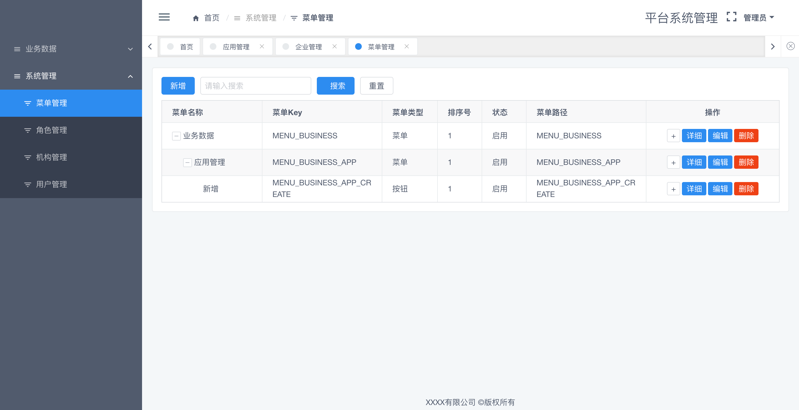

# 说明

一个完整的基础后台管理项目，包含vue前端和java后端服务

前端技术基于vue + iview + iview-admin
后端基于springboot + spring-data-jpa，

特性：
- 领域事件（Domain Events）、
- 登录和token验证、
- 菜单权限、
- RESTful标准接口、
- 代码生成标准接口Controller等特性。
- 基于jpa的分页列表查询
- 机构和菜单等树型数据的便捷处理
- 本地开发直接使用h2数据库，无需依赖mysql建表
- 为了进行token认证，需要依赖redis

可以基于此项目进行扩展快速实现一个简单优雅的管理后台项目。

# 编译与运行

## 后端服务运行：运行Main入口类，或者编译打包运行

## 前端项目运行：

- 先编译安装依赖

```
npm install
```

- 运行或打包

开发dev运行：
```
npm run dev
```

生产prod打包：
```
npm run build
```


# 业务模块

## 业务数据
- 应用管理


- 企业管理（也可理解为租户管理）


## 系统管理
- 菜单管理




- 机构管理


- 角色管理（可针对角色配置其所有菜单权限）


- 用户管理（一个用户可配置多页角色）


# 特性说明

## 领域事件（Domain Events）

使用spring-data-jpa，而非mybatis的原因就是为了要实现领域事件，更好的适配基于领域事件驱动的开发。

- 定义领域模型事件：例如，我们希望定义一个用户保存的事件，每次用户对象被保存持久化，就会发出一个应用事件
```java
import com.dancers.service.system.domain.SystemUser;
import org.springframework.context.ApplicationEvent;

public class SystemUserSavedEvent extends ApplicationEvent {
    public SystemUserSavedEvent(SystemUser user) {
        super(user);
    }
}
```

- 在模型对象内（例如SystemUser对象）注册事件：
```java
@DomainEvents
    Collection<Object> domainEvents() {
        log.info("calling domainEvents in SystemUser");
        List<Object> events = new ArrayList<>();
        events.add(new SystemUserSavedEvent(this));
        return events;
    }

    @AfterDomainEventPublication
    void callback() {
        log.info("calling callback in SystemUser");
    }
```

- 提供一个领域事件的监听处理器：
```java
import com.dancers.service.system.domain.event.SystemCorpSavedEvent;
import lombok.extern.slf4j.Slf4j;
import org.springframework.scheduling.annotation.Async;
import org.springframework.stereotype.Component;
import org.springframework.transaction.event.TransactionalEventListener;

@Slf4j
@Component
public class DomainEventHandler {
    @Async
    @TransactionalEventListener
    public void HandleSystemCorpSavedEvent(SystemCorpSavedEvent event) {
        log.info("handling SystemCorpSavedEvent, data=" + event.getSource());
        Long corpId = (Long) event.getSource();
    }
}

```

如此，在实际事务中，每次进行用户保存，也就是SystemUserRepository.save()，都会发出事件，并被DomainEventHandler监听到，然后在DomainEventHandler内进行想要进行的异步处理


## 菜单权限控制

针对每个用户，可配置多个角色，每个角色可以配置相应的菜单权限，那么在用户登录后，就可以获取到他账号所拥有的所有菜单权限。

使用的iview-admin，在定义路由route的时候，有一个access的属性，可以为每个菜单提供一个该菜单Key的access属性，然后在用户登录的时候，获取账号所拥有的所有菜单权限，作为一个数组返回给前端，前端通过store保存到localStore中，保存为一个aceess数组，那么加载路由菜单时，就会检查用户是有拥有该菜单的acess的Key，有则显示，没有则隐藏。

菜单路由例子：
```js
{
    path: 'users',
    name: 'users',
    meta: {
      icon: 'md-funnel',
      access: ['MENU_SYSTEM_USER'],
      title: '用户管理'
    },
    component: () => import('@/view/system/users.vue')
  },
```